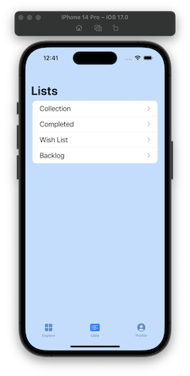
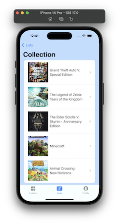
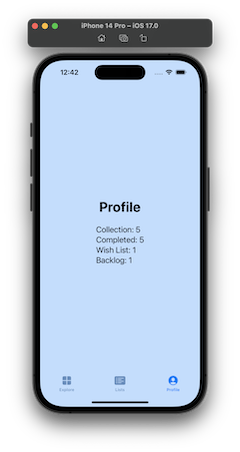

# **_Collectathon_ - Full-Stack iOS App**
## _An IUPUI Computer Science Capstone Project_

For my 2023 senior capstone project at Indiana University Purdue University Indianapolis (IUPUI), I set out to create a focus-piece for my portfolio that showcases a variety of skills I have learned from IUPUI's computer science curriculum. My goals for this project were to:
1. Demonstrate my abilities to design and develop a full stack application from conception to deployment.
2. Determine a stack that is ideal for the needs of the project.
3. Learn to set up a server-side module from scratch. This includes learning to initialize a database, run a local server, create a REST API, and transport data using HTTP requests through these API endpoints.
4. Create a client-side module for a mobile iOS application to present and manage data retrieved from the server.

I believe I was able to accomplish these goals successfully. Not only did I demonstrate my software engineering skills, I created an application that solves a real-world problem. I enjoyed developing and using this application, so in the future I will continue to add features to make the app even more helpful for me. The following sections will describe what the application does, how I was able to develop it, and how you can run it. 

If you want to skip to how to run the application, follow the table of contents to the _Building and Running the Application_ sections.

## Table of Contents
- [Features](https://github.com/caleb765landis/Capstone.git#features)
- [Technologies Used](https://github.com/caleb765landis/Capstone.git#technologies-used)
- [Building and Running the Application](https://github.com/caleb765landis/Capstone.git#building-and-running-the-application)
- [Resources and Acknowledgements](https://github.com/caleb765landis/Capstone.git#resources-and-acknowledgements)
- [Other Tools](https://github.com/caleb765landis/Capstone.git#other-tools)

## Features
_Collectathon_ is a video game library management system that helps users organize video games into lists of different categories.

### Explore
Users can browse the explore page to see a list of 50 of the highest rated video games from igdb.com. They can also search for specific games in this website's database as well.


### Game Info
After choosing a game to explore, users can see some general information in the _About_ view such as release date, genre, platform, and a short description about the game. When navigating to the _Tags_ view, users can tag games by toggling which lists the game should be added to.


### Lists
The _Lists_ view organizes corresponding tagged games into four categories: _Collection, Completed, Wish List, and Backlog_. 




### Profile
The _Profile_ view keeps track of how many games are in each list.



### Future Additions
The future of _Collectathon_ will turn the app into more of a social platform where users can share their video game collections and reviews of games they have played. More features that will be added include: 
- Create, edit, and remove tag lists.
- User registration and login.
- Filter games in lists based on genre, platform, and release date.
- User reviews.
- User time logs where they can keep track of how long they've been playing games by using a timer to track when they start and stop playing a game.
- Updated profile view with more user information, public lists, their reviews, and time logs.
- Public/Private toggle for profiles, lists, reviews, and time logs.
- Following other users.

## Technologies Used
When choosing a stack to develop my application with, I knew I needed frameworks that focused on mobile development. I determined this when planning my ideal user experience, as I knew the easiest way to catalogue a game library would be with a phone or a tablet. Future features of the app would be social media based, and it would also be easier for users to use a timer on mobile when keeping track of game time logs - further justifying my conclusion. Since my mobile device was an iPhone, I figured now was a good time to finally learn Apple's _Swift_ programming language.

### It's all written in Swift?!
Much in Apple fashion, I deemed it best to stick within the Apple ecosystem when developing the application. _SwiftUI_ was an obvious framework choice to code the iOS app with, especially if I were to eventually make it cross-platform across Apple devices, The real difficulty when choosing a stack was how to code the backend. When I first started this project, I had no experience with setting up a Node.js server. Since I only had three quarters of a semester to work on this project, I also did not want to spend too much time learning too many different technologies. Fortunately for me, I discovered _Vapor_, a backend web framework for Swift, which allowed me to write the entire project in one language. Using Vapor, I was able to write an HTTP server that could handle routing my own RESTful API. 

### Managing Data
Another hurdle when developing _Collectathon_ was figuring out how to get information about each video game. I knew it was impractical to enter data for _every single_ game myself, and having users come up with their own information to add for each game also felt clunky. My solution to this was to query data from an external API. Luckily for me, Twitch.tv operates IGDB.com, which is a website with a massive video game database and a well-documented developer API. This was perfect for me to get video game data for free, and it also served as a great resource for getting me started with creating my own first API. To gain access to this data, I needed to set up a Twitch Developer account so I could get authorization to use the IGDB API via app access tokens. This served as a great experience for learning about authorization and tokenization.

My project still required me to store some of my own data. Vapor uses an object relational mapping ORM framework for Swift called _Fluent_. This was beneficial because I could use Swift's strong type system to use object-oriented models, then I could use Fluent to convert those objects into relational data. Fluent has four officially supported database drivers; I chose to use _MongoDB_ because I wanted to learn how to use a schemaless NoSQL database since I had only used relational databases before. 

I ran the MongoDB database locally through a server in a _Docker_ container. The database currently stores three models: _Tag, TaggedGame,_ and _User_. These models have been designed to work with more models such as _TimeLog_ and _Review_ for when these features get added in the future. This database follows a fully normalized design, which is shown in the Entity Relation Diagram Below.


## Building and Running the Application
The app was written using Swift 5.9 and XCode 15. I have only tested and ran the application using MacOS and iOS. The backend will run on MacOS 12+, using [Vapor 4](https://docs.vapor.codes/install/macos/) for the server and Docker 20+ to run the MongoDB image. The client-side will run the iOS app on version 16.2 and up.

### 1. Start a MongoDB server instance.
The easiest way I found to use MongoDB was locally on my MacBook using Docker. Make sure you have Docker installed on your device, then navigate to the Server-Side directory in your terminal. The following command will run a new container named mongo and automatically download the mongo image if it is not already present on your computer:

```sh
docker run --name mongo \ 
	-e MONGO_INITDB_DATABASE=vapor \ 
	-p 27017:27017 -d mongo
```
To make sure the container is running, enter this command: ```docker ps```.
If you want to pause running the MongoDB server in the Docker container, enter: ```docker pause mongo```.
Use ```docker restart mongo``` to start the server back up after pausing.

### 2. Build and run the Vapor server.
Stay in the Server-Side directory to start the backend Vapor server. Run ```swift run```, which will also load starting data into MongoDB upon the first time using the database.

### 3. Build and open the iOS app.
Navigate to the Client-Side directory and open the project in XCode. The following image can be used as a reference for which lines to edit in the Utilities.swift file to connect to the backend server correctly depending on how you are running the app.


#### Locally on a Simulator
The app was tested locally using an iPhone 14 Pro simulator. In XCode, set the target device to an iPhone 14 Pro or newer device. Open Utilities.swift and comment out line 46 which is used for running the app on an actual iPhone instead of in a simulator. Uncomment line 49, which will connect the backend API to the localhost address. Finally, you can click the run button to build and run the app on the simulator.

#### On an iPhone
The app was tested externally using an iPhone XR. Connect your phone to your computer via USB, then in XCode, set the target device to the one you connected. Open Utilities.swift and change part of the string in line 46 from ```10.0.0.134``` to the IP address your computer is using. Finally, you can click the run button to build, install, and run the app on your phone.

## Resources and Acknowledgements
- [Vapor Docs](https://docs.vapor.codes/) - Documentation for installing and learning Vapor.
- [An article by Kaitlin Mahar](https://www.mongodb.com/developer/code-examples/swift/full-stack-swift/) - I got my idea to use Vapor as my backend from this article. I also used the example project from this article as a reference for modeling much of how I should design a full-stack iOS app.
- [Mikaela Caron's YouTube Series](https://www.youtube.com/playlist?list=PLMRqhzcHGw1Z7xNnqS_yUNm1k9dvq-HbM) - Kaitlin Mahar's project was heavily influenced by this video series, which in turn heavily influenced the design of my project.
- [Kodeco](https://www.kodeco.com/books/server-side-swift-with-vapor/v3.0/chapters/1-introduction) - Great resource for learning how to use async/await as well as API controllers in Vapor.
- [IGDB API Docs](https://api-docs.igdb.com) - Great documentation for IGDB's database API.
- [Twitch Developer Docs](https://dev.twitch.tv/docs/authentication/#app-access-tokens) - Documentation for Twitch API authentication.

### Other Tools
- XCode - IDE for writing and building Swift code
- GitHub - Git version control
- Postman - Testing API endpoints
- Docker - MongoDB server environment container
- Whimsical - Wireframe design
- Mermaid Live Editor - ER diagram creation
- Dillinger - Markdown editor


